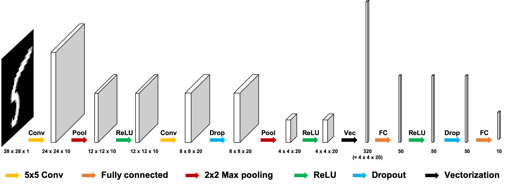

# [CNN Implementation] 001 - MNIST

### Link
[Github](https://github.com/hanyoseob/youtube-001-pytorch-mnist)

### Network architecture

### Train
    $ python train.py

### Evaluation
    $ python eval.py

### Tensorboard
    $ tensorboard --logdir ./log

### Result
|        Metrics     | CNN   |
|:------------------:|:---------:|
| Cross Entropy Loss | 0.0443    |
| Accuracy (%)       | 98.5870   |

